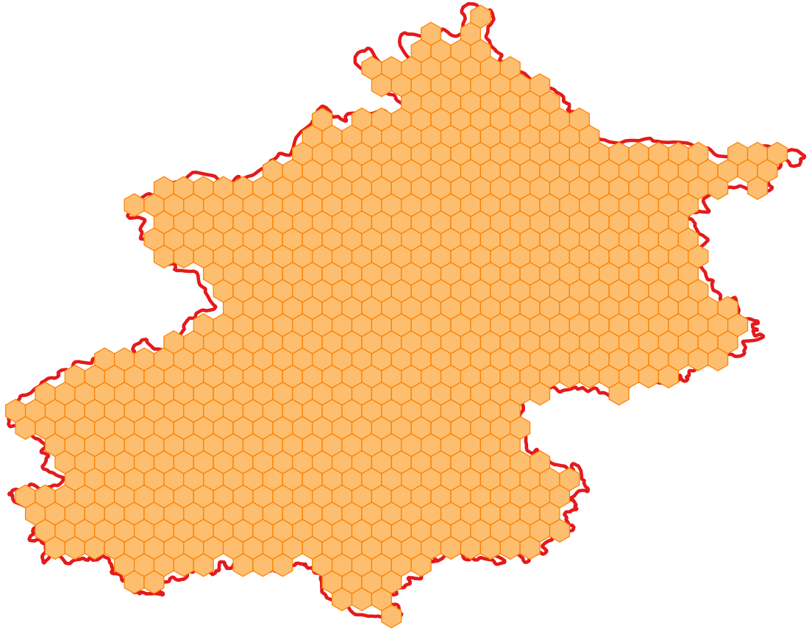

# 概述
本文讲述如何在geotools中实现蜂巢效果。

# 效果


# 实现
#### 1.扩展类IntersectionBuilder
```java
import com.vividsolutions.jts.geom.Coordinate;
import com.vividsolutions.jts.geom.Geometry;
import com.vividsolutions.jts.geom.GeometryFactory;
import java.io.IOException;
import java.util.Map;
import org.geotools.data.simple.SimpleFeatureSource;
import org.geotools.factory.CommonFactoryFinder;
import org.geotools.geometry.jts.JTSFactoryFinder;
import org.geotools.grid.GridElement;
import org.geotools.grid.GridFeatureBuilder;
import org.geotools.grid.PolygonElement;
import org.opengis.feature.simple.SimpleFeatureType;
import org.opengis.filter.Filter;
import org.opengis.filter.FilterFactory2;

public class IntersectionBuilder extends GridFeatureBuilder {
    final FilterFactory2 ff2 = CommonFactoryFinder.getFilterFactory2();
    final GeometryFactory gf = JTSFactoryFinder.getGeometryFactory();

    final SimpleFeatureSource source;
    int id = 0;

    public IntersectionBuilder(SimpleFeatureType type, SimpleFeatureSource source) {
        super(type);
        this.source = source;
    }

    public void setAttributes(GridElement el, Map<String, Object> attributes) {
        attributes.put("id", ++id);
    }

    @Override
    public boolean getCreateFeature(GridElement el) {
        Coordinate c = ((PolygonElement) el).getCenter();
        Geometry p = gf.createPoint(c);
        Filter filter = ff2.intersects(ff2.property("the_geom"), ff2.literal(p));
        boolean result = false;

        try {
            result = !source.getFeatures(filter).isEmpty();
        } catch (IOException ex) {
            throw new IllegalStateException(ex);
        }

        return result;
    }
}
```
### 2.实现类HexGrid
```java

import com.lzugis.geotools.utils.IntersectionBuilder;
import com.vividsolutions.jts.geom.Geometry;
import com.vividsolutions.jts.geom.Point;
import com.vividsolutions.jts.geom.Polygon;
import org.geotools.data.FeatureWriter;
import org.geotools.data.FileDataStore;
import org.geotools.data.FileDataStoreFinder;
import org.geotools.data.Transaction;
import org.geotools.data.shapefile.ShapefileDataStore;
import org.geotools.data.shapefile.ShapefileDataStoreFactory;
import org.geotools.data.simple.SimpleFeatureCollection;
import org.geotools.data.simple.SimpleFeatureIterator;
import org.geotools.data.simple.SimpleFeatureSource;
import org.geotools.feature.simple.SimpleFeatureTypeBuilder;
import org.geotools.geometry.jts.ReferencedEnvelope;
import org.geotools.grid.Envelopes;
import org.geotools.grid.GridFeatureBuilder;
import org.geotools.grid.Grids;
import org.geotools.grid.hexagon.HexagonOrientation;
import org.geotools.grid.hexagon.Hexagons;
import org.geotools.referencing.crs.DefaultGeographicCRS;
import org.opengis.feature.simple.SimpleFeature;
import org.opengis.feature.simple.SimpleFeatureType;

import java.io.File;
import java.io.Serializable;
import java.nio.charset.Charset;
import java.util.HashMap;
import java.util.List;
import java.util.Map;

public class HexGrid {
    /**
     * 保存为shp文件
     * @param filepath
     * @param sfsGrid
     */
    public void writeShape(String filepath, SimpleFeatureSource sfsGrid) {
        try {
            //创建shape文件对象
            File file = new File(filepath);
            Map<String, Serializable> params = new HashMap<String, Serializable>();
            params.put( ShapefileDataStoreFactory.URLP.key, file.toURI().toURL() );
            ShapefileDataStore ds = (ShapefileDataStore) new ShapefileDataStoreFactory().createNewDataStore(params);
            //定义图形信息和属性信息
            SimpleFeatureTypeBuilder tb = new SimpleFeatureTypeBuilder();
            tb.setCRS(DefaultGeographicCRS.WGS84);
            tb.setName("shapefile");
            tb.add("the_geom", Polygon.class);
            tb.add("id", Integer.class);
            ds.createSchema(tb.buildFeatureType());
            //设置编码
            Charset charset = Charset.forName("GBK");
            ds.setCharset(charset);
            //设置Writer
            FeatureWriter<SimpleFeatureType, SimpleFeature> writer = ds.getFeatureWriter(ds.getTypeNames()[0], Transaction.AUTO_COMMIT);
            SimpleFeatureCollection resultgrid = sfsGrid.getFeatures();
            SimpleFeatureIterator itertorgrid = resultgrid.features();
            while (itertorgrid.hasNext()) {
                SimpleFeature feature = itertorgrid.next();
                SimpleFeature featureBuf = writer.next();
                featureBuf.setAttributes(feature.getAttributes());
            }
            writer.write();
            writer.close();
            ds.dispose();
        }
        catch (Exception e) {
            e.printStackTrace();
        }
    }

    /**
     * 生成蜂巢
     * @param shpfile
     * @param sideLen
     * @return
     */
    public SimpleFeatureSource createGrid(String shpfile, float sideLen){
        try {
            File file = new File(shpfile);
            ShapefileDataStore shpDataStore = null;
            shpDataStore = new ShapefileDataStore(file.toURL());
            //设置编码
            Charset charset = Charset.forName("GBK");
            shpDataStore.setCharset(charset);
            String typeName = shpDataStore.getTypeNames()[0];
            SimpleFeatureSource featureSource = null;
            featureSource = shpDataStore.getFeatureSource(typeName);
            // Set the grid size (1 degree) and create a bounding envelope
            // that is neatly aligned with the grid size
            ReferencedEnvelope gridBounds = Envelopes.expandToInclude(featureSource.getBounds(), sideLen);
            // Create a feature type
            SimpleFeatureTypeBuilder tb = new SimpleFeatureTypeBuilder();
            tb.setName("grid");
            tb.add(
                    GridFeatureBuilder.DEFAULT_GEOMETRY_ATTRIBUTE_NAME,
                    Polygon.class,
                    gridBounds.getCoordinateReferenceSystem());
            tb.add("id", Integer.class);
            SimpleFeatureType TYPE = tb.buildFeatureType();

            // Build the grid the custom feature builder class
            GridFeatureBuilder builder = new IntersectionBuilder(TYPE, featureSource);
            SimpleFeatureSource grid =
                    Hexagons.createGrid(gridBounds, sideLen, HexagonOrientation.ANGLED, builder);
            return grid;
        }catch (Exception e){
            e.printStackTrace();
            return null;
        }
    }

    public static void main(String[] args) throws Exception{
        long start = System.currentTimeMillis();
        HexGrid hexGrid = new HexGrid();
        String path = "D:\\data\\beijing\\";
        String shpfile = path+"beijing.shp";
        String gridFile = path+"bj_grid.shp";
        float sideLen = 0.03f;
        hexGrid.writeShape(gridFile, hexGrid.createGrid(shpfile, sideLen));
        System.out.println("共耗时"+(System.currentTimeMillis() - start)+"ms");
    }
}
```